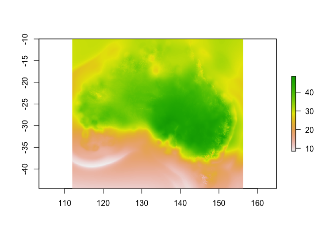
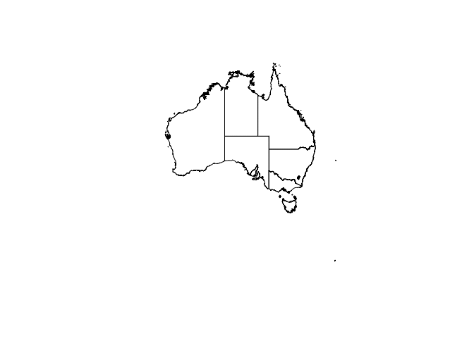
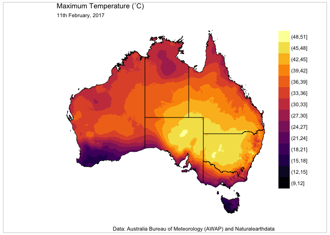

Using viridis' "inferno" to map Australian temperatures on Feb. 11, 2017
========================================================================

This is a fork of @njtierney's [ozviridis](https://github.com/njtierney/ozviridis) project. I'm building on what he's started, but making the map my way.

As Nicholas originally observed on 12-Feb-2017,

> "there's a heatwave in Australia at the moment. And this is the heatmap that is getting shown of Australia:


> Which shows that things are really hot.

Verymuchso.

> But it's also pretty darn ugly.

Almost as ugly as the temperatures outside.

Nicholas wanted to see if he could use the `viridis` package to improve this map. I completely agree. This should be doable.

To do this you'll need a few packages from CRAN:

``` r
library(raster)
```

    ## Loading required package: sp

``` r
library(ggplot2)
library(viridis)
library(ggthemes)
library(grid)
library(gridExtra)
```

One from ROpenSciLabs, [rnaturalearth](https://github.com/ropenscilabs/rnaturalearth):

``` r
if (!require("devtools")) install.packages("devtools")
```

    ## Loading required package: devtools

``` r
devtools::install_github("ropenscilabs/rnaturalearth")
```

    ## Skipping install of 'rnaturalearth' from a github remote, the SHA1 (cc17bb58) has not changed since last install.
    ##   Use `force = TRUE` to force installation

``` r
library("rnaturalearth")
```

And one from SWISH, [awaptools](https://github.com/swish-climate-impact-assessment/awaptools):

``` r
devtools::install_github("awaptools", "swish-climate-impact-assessment")
```

    ## Warning: Username parameter is deprecated. Please use swish-climate-impact-
    ## assessment/awaptools

    ## Skipping install of 'awaptools' from a github remote, the SHA1 (9b93f025) has not changed since last install.
    ##   Use `force = TRUE` to force installation

``` r
library(awaptools)
```

Using `awaptools` get the mean maximum for February 12 2017.

``` r
awaptools::get_awap_data(start = "2017-02-11", end = "2017-02-11", measure = "maxave")

oz_heat <- raster::raster("maxave_2017021120170211.grid")
```

``` r
raster::plot(oz_heat)
```



The plot works, the colours might not be any better than BoM though. We'll get to that.

Adding the shapefile of Australia
---------------------------------

Now that the temperature data is in R, use the `rnaturalearthdata` package to get an outline of Australia. We'll use this to map so we can see the states, but also to clean up the map a bit, see that previous figure? You can sorta pick Australia out, but it's not clearly defined. We can use this to fix that.

``` r
oz_shape <- rnaturalearth::ne_states(geounit = "australia")

sp::plot(oz_shape)
```



Clean up the heat map
---------------------

Using the [Naturalearthdata](http://www.naturalearthdata.com) object, now mask out only landmasses and trim down the outline, removing islands that stretch the map and aren't of interest. Note that we mask using the naturalearth object and crop using the heat map.

``` r
oz_heat <- raster::mask(oz_heat, oz_shape)
oz_shape <- raster::crop(oz_shape, oz_heat)
```

    ## Loading required namespace: rgeos

Plot using ggplot2
------------------

Now we're ready to plot this up using `ggplot2`, but first, we need to make the raster object into a format that `ggplot2` can use.

``` r
# Extract the data into a matrix
oz_heat <- rasterToPoints(oz_heat)

# Make the matrix a dataframe for ggplot
oz_heat_df <- data.frame(oz_heat)

# Make appropriate column headings
colnames(oz_heat_df) <- c("Longitude", "Latitude", "Temperature")
```

Classify the heat map
---------------------

BoM shows the map in 3˚increments. We can reclassify the raster so that it will display in the same way.

Using the `cut` function, we'll set up our map in the same way.

``` r
oz_heat_df$cuts <- as.factor(cut(oz_heat_df$Temperature,
                           include.lowest = TRUE,
                           breaks = seq(-6, 54, by = 3)))
```

Now, you can plot these together. Plot the new `data.frame`, `oz_heat` and layer a map of Australia on top of it. The Australian map can be plotted directly from the spatial data, using the following method as described in the tidyverse here, <https://github.com/tidyverse/ggplot2/wiki/plotting-polygon-shapefiles>:

``` r
oz <- ggplot2::ggplot(data = na.omit(oz_heat_df), 
                      aes(y = Latitude, x = Longitude)) +
  ggplot2::geom_raster(aes(fill = cuts)) +
  viridis::scale_fill_viridis(option = "inferno", discrete = TRUE) +
  ggplot2::guides(fill = guide_legend(reverse = TRUE)) +
  ggplot2::geom_polygon(data = oz_shape, 
                        aes(x = long, y = lat, group = group),
                        fill = NA, color = "black", size = 0.25) +
  ggthemes::theme_map() +
  ggplot2::theme(legend.position = c(1, 0.15),
                 legend.text = element_text(size = 8),
                 legend.title = element_blank()) +
  ggplot2::labs(title = "Maximum Temperature (˚C)", 
                subtitle = "11th February, 2017", 
                caption = "Data: Australia Bureau of Meteorology (AWAP) and Naturalearthdata") +
  ggplot2::coord_quickmap()
```

    ## Regions defined for each Polygons

``` r
# Using the gridExtra and grid packages add a neatline to the map
gridExtra::grid.arrange(oz, ncol = 1)
grid::grid.rect(width = 0.98, 
                height = 0.98, 
                gp = grid::gpar(lwd = 0.25, 
                                col = "black",
                                fill = NA))
```



That's much better and pretty close to what BoM originally created. Using any of the `ggplot` `panel.background` or `panel.grid` result in the legend being outside the line, so not really a neatline for a map. Using the `gridExtra` and `grid` packages fixes this.

Cleanup on the way out
----------------------

Remove the grid file that we downloaded earlier.

``` r
unlink("maxave_2017021220170212.grid")
```

Appendix
--------

``` r
sessionInfo()
```

    ## R version 3.3.2 (2016-10-31)
    ## Platform: x86_64-apple-darwin15.6.0 (64-bit)
    ## Running under: OS X El Capitan 10.11.6
    ## 
    ## locale:
    ## [1] en_AU.UTF-8/en_AU.UTF-8/en_AU.UTF-8/C/en_AU.UTF-8/en_AU.UTF-8
    ## 
    ## attached base packages:
    ## [1] grid      stats     graphics  grDevices utils     datasets  methods  
    ## [8] base     
    ## 
    ## other attached packages:
    ## [1] awaptools_1.2.1     rnaturalearth_0.1.0 devtools_1.12.0    
    ## [4] gridExtra_2.2.1     ggthemes_3.3.0      viridis_0.3.4      
    ## [7] ggplot2_2.2.1       raster_2.5-8        sp_1.2-4           
    ## 
    ## loaded via a namespace (and not attached):
    ##  [1] Rcpp_0.12.9                   knitr_1.15.1                 
    ##  [3] magrittr_1.5                  munsell_0.4.3                
    ##  [5] colorspace_1.3-2              lattice_0.20-34              
    ##  [7] R6_2.2.0                      httr_1.2.1                   
    ##  [9] stringr_1.1.0                 plyr_1.8.4                   
    ## [11] rnaturalearthhires_0.0.0.9000 tools_3.3.2                  
    ## [13] rgdal_1.2-5                   gtable_0.2.0                 
    ## [15] git2r_0.18.0                  withr_1.0.2                  
    ## [17] rgeos_0.3-22                  htmltools_0.3.5              
    ## [19] yaml_2.1.14                   lazyeval_0.2.0               
    ## [21] rprojroot_1.2                 digest_0.6.12                
    ## [23] assertthat_0.1                tibble_1.2                   
    ## [25] curl_2.3                      memoise_1.0.0                
    ## [27] evaluate_0.10                 rmarkdown_1.3                
    ## [29] labeling_0.3                  stringi_1.1.2                
    ## [31] scales_0.4.1                  backports_1.0.5
