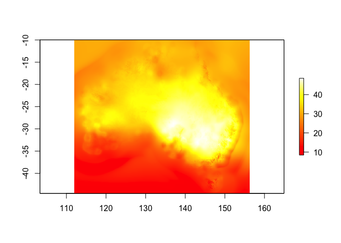
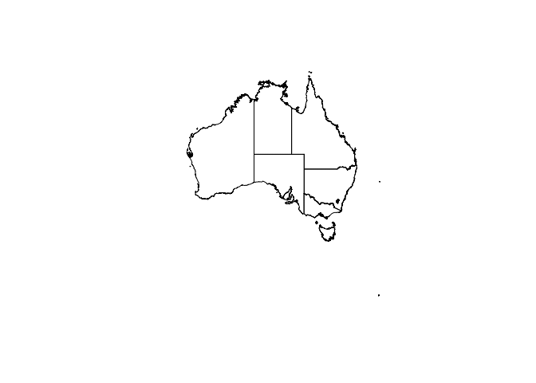
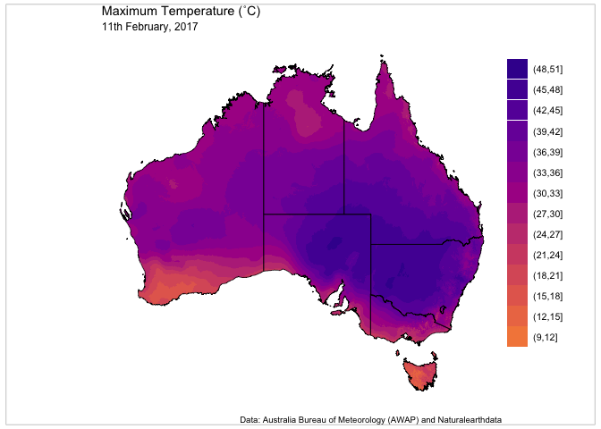

# Notes on Jul. 20, 2020

As I’ve done some reading and been revisiting this idea, I realised that
I had probably mapped the colours backwards. I should have been using
darker colours for the higher temperatures. When I tried this using the
‘inferno’ palette there was little or no discernible colour separation
at the highest temperatures and these details were lost in the map.
Switching to ‘plasma’ made these details much more clear and the map now
displays the hottest temperatures as the darkest part of the map.

# Using the viridis ~~“inferno”~~ “plasma” colour pallete to map Australian temperatures on Feb. 11, 2017

This is a fork of [njtierney’s](https://github.com/njtierney/)
[ozviridis](https://github.com/njtierney/ozviridis) project. I’m
building on what he’s started, but making the map my way.

As Nicholas originally observed on 12-Feb-2017,

> "there’s a heatwave in Australia at the moment. And this is the
> heatmap that is getting shown of Australia:


> Which shows that things are really hot.

Verymuchso.

> But it’s also pretty darn ugly.

Almost as ugly as the temperatures outside.

Nicholas wanted to see if he could use the viridis package to improve
this map. I completely agree; this should be doable.

## Setup

To do this you’ll need a few packages from CRAN:

``` r
if(!require(pacman)) {
  install.packages("pacman")
}
```

    ## Loading required package: pacman

``` r
pacman::p_load("raster",
               "ggplot2",
               "ggthemes",
               "viridis",
               "grid",
               "gridExtra",
               "rnaturalearth"
)
```

And one from SWISH,
[awaptools](https://github.com/swish-climate-impact-assessment/awaptools):

``` r
pacman::p_load_gh("swish-climate-impact-assessment/awaptools")
```

## Get the data to recreate our map

### BoM AWAP grids

Using awaptools get the mean maximum for February 11 2017.

``` r
get_awap_data(start = "2017-02-11",
              end = "2017-02-11",
              measure_i = "maxave")
```

    ## [1] "Non linux or windows os detected. Assume linux-alike."
    ## [1] "maxave_2017021120170211.grid.Z"

``` r
oz_heat <- raster("maxave_2017021120170211.grid")
```

``` r
plot(oz_heat, col = heat.colors(n = length(unique(oz_heat))))
```

<!-- -->

The plot works, the colours might not be any better than BoM though.
We’ll get to that.

### Adding a shapefile of Australia

Now that the temperature data is in R, use the rnaturalearth package to
get an outline of Australia. We’ll use this to map so we can see the
states, but also to clean up the map a bit, see that previous figure?
You can sorta pick Australia out, but it’s not clearly defined. We can
use this to fix that.

``` r
oz_shape <- ne_states(geounit = "australia", returnclass = "sp")

plot(oz_shape)
```

<!-- -->

### Clean up the heat map

Using raster package functions with the
[Naturalearthdata](http://www.naturalearthdata.com) object, now mask out
only landmasses and trim down the outline, removing islands that stretch
the map and aren’t of interest. Note that we mask using the naturalearth
object and crop using the heat map.

``` r
oz_heat <- mask(oz_heat, oz_shape)
oz_shape <- crop(oz_shape, oz_heat)
```

# Plot using ggplot2 and viridis

Now we’re ready to plot this up using ggplot2, but first, we need to
make the raster object into a format that ggplot2 can use.

``` r
# Extract the data into a data.frame for ggplot2
oz_heat_df <- as.data.frame(raster::rasterToPoints(oz_heat))

# Make appropriate column headings
colnames(oz_heat_df) <- c("Longitude", "Latitude", "Temperature")
```

## Classify the heat map

BoM shows the map in 3 ˚C increments. We can reclassify the raster so
that it will display in the same way.

Using the `cut()` function, we’ll set up our map in the same way.

``` r
oz_heat_df$cuts <- as.factor(cut(
  oz_heat_df$Temperature,
  include.lowest = TRUE,
  breaks = seq(-6, 54, by = 3)
))
```

## The final product

Now, you can plot these together. Plot the new `data.frame`, `oz_heat`
and layer a map of Australia on top of it. The Australian map can be
plotted directly from the spatial data, using the following method as
described in the tidyverse here,
<https://github.com/tidyverse/ggplot2/wiki/plotting-polygon-shapefiles>:

``` r
oz <- ggplot(data = na.omit(oz_heat_df),
             aes(y = Latitude, x = Longitude)) +
  geom_raster(aes(fill = cuts)) +
  scale_fill_viridis(option = "plasma",
                     discrete = TRUE,
                     direction = -1) +
  guides(fill = guide_legend(reverse = TRUE)) +
  geom_polygon(
    data = oz_shape,
    aes(x = long, y = lat, group = group),
    fill = NA,
    color = "black",
    size = 0.25
  ) +
  theme_map() +
  theme(
    legend.position = c(1, 0.15),
    legend.text = element_text(size = 8),
    legend.title = element_blank()
  ) +
  labs(title = "Maximum Temperature (˚C)",
       subtitle = "11th February, 2017",
       caption = "Data: Australia Bureau of Meteorology (AWAP) and Naturalearthdata") +
  coord_quickmap()
```

    ## Regions defined for each Polygons

``` r
# Using the gridExtra and grid packages add a neatline to the map
grid.arrange(oz, ncol = 1)
```

    ## Warning: Raster pixels are placed at uneven vertical intervals and will be
    ## shifted. Consider using geom_tile() instead.

``` r
grid.rect(
  width = 0.98,
  height = 0.98,
  gp = gpar(lwd = 0.25,
            col = "black",
            fill = NA)
)
```

<!-- -->

That’s much better and pretty close to what BoM originally created.
Using any of the ggplot `panel.background` or `panel.grid` result in the
legend being outside the line, so not really a neatline for a map. Using
the gridExtra and grid packages fixes this.

## Cleanup on the way out

Remove the grid file that we downloaded earlier.

``` r
unlink("maxave_2017021120170211.grid")
```

# Meta

Please note that this project is released with a [Contributor Code of
Conduct](CONDUCT.md). By participating in this project you agree to
abide by its terms.

# Appendix

    ## R version 4.0.2 (2020-06-22)
    ## Platform: x86_64-apple-darwin17.0 (64-bit)
    ## Running under: macOS Catalina 10.15.6
    ## 
    ## Matrix products: default
    ## BLAS:   /Library/Frameworks/R.framework/Versions/4.0/Resources/lib/libRblas.dylib
    ## LAPACK: /Library/Frameworks/R.framework/Versions/4.0/Resources/lib/libRlapack.dylib
    ## 
    ## locale:
    ## [1] en_AU.UTF-8/en_AU.UTF-8/en_AU.UTF-8/C/en_AU.UTF-8/en_AU.UTF-8
    ## 
    ## attached base packages:
    ## [1] grid      stats     graphics  grDevices utils     datasets  methods  
    ## [8] base     
    ## 
    ## other attached packages:
    ##  [1] awaptools_1.2.1     rnaturalearth_0.1.0 gridExtra_2.3      
    ##  [4] viridis_0.5.1       viridisLite_0.3.0   ggthemes_4.2.0     
    ##  [7] ggplot2_3.3.2       raster_3.3-13       sp_1.4-2           
    ## [10] pacman_0.5.1       
    ## 
    ## loaded via a namespace (and not attached):
    ##  [1] Rcpp_1.0.5.1             compiler_4.0.2           pillar_1.4.6            
    ##  [4] class_7.3-17             tools_4.0.2              digest_0.6.25           
    ##  [7] evaluate_0.14            lifecycle_0.2.0          tibble_3.0.3            
    ## [10] gtable_0.3.0             lattice_0.20-41          pkgconfig_2.0.3         
    ## [13] rlang_0.4.7              DBI_1.1.0                rgdal_1.5-12            
    ## [16] yaml_2.2.1               parallel_4.0.2           xfun_0.15               
    ## [19] e1071_1.7-3              withr_2.2.0              stringr_1.4.0           
    ## [22] dplyr_1.0.0              knitr_1.29               rgeos_0.5-3             
    ## [25] generics_0.0.2           vctrs_0.3.2              classInt_0.4-3          
    ## [28] tidyselect_1.1.0         glue_1.4.1               sf_0.9-5                
    ## [31] R6_2.4.1                 rmarkdown_2.3            farver_2.0.3            
    ## [34] purrr_0.3.4              magrittr_1.5             rnaturalearthhires_0.2.0
    ## [37] units_0.6-7              scales_1.1.1             codetools_0.2-16        
    ## [40] htmltools_0.5.0          ellipsis_0.3.1           colorspace_1.4-2        
    ## [43] labeling_0.3             KernSmooth_2.23-17       stringi_1.4.6           
    ## [46] munsell_0.5.0            crayon_1.3.4
